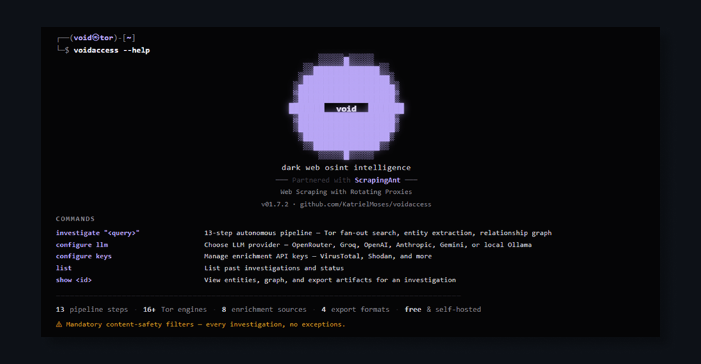

<p align="center">
  
</p>

<h1 align="center">VoidAccess</h1>

<p align="center">
  <a href="LICENSE"></a>
  <a href="https://www.python.org/"></a>
  <a href="docker-compose.yml"></a>
  <a href="https://pypi.org/project/voidaccess/"></a>
  <a href="https://pypi.org/project/voidaccess/"></a>
</p>

Self-hostable OSINT for turning dark-web research queries into structured threat intelligence. Built for security researchers, threat-intelligence teams, and authorized investigators who need collection, enrichment, relationship mapping, and export in one workflow.

## Terminal Output



## Quick Start

```bash
pip install voidaccess
voidaccess investigate "LockBit ransomware" --no-llm --no-tor --depth shallow
voidaccess list
voidaccess actors
voidaccess status
```


## What It Does

- **Parallel collection** - searches Tor indexes, paste sites, code forges, security feeds, and curated `.onion` seeds.
- **Entity extraction** - finds IOCs, wallets, credentials, handles, vulnerabilities, actors, malware, people, and organizations.
- **Multi-source enrichment** - adds reputation, breach, passive DNS, sandbox, blockchain, and threat-feed context.
- **Actor intelligence** - persists aliases, infrastructure, notes, timelines, and cross-investigation relationships.
- **Relationship graphs** - builds co-occurrence graphs, communities, paths, and infrastructure clusters.
- **Content safety** - filters prohibited queries, URLs, content, and extracted entities at mandatory pipeline gates.
- **Structured exports** - produces STIX 2.1, MISP, Sigma, YARA, Snort, Suricata, CSV, Markdown, JSON, and IOC packages.
- **CLI and web UI** - runs locally with SQLite or as a Docker Compose stack with PostgreSQL and a browser interface.

## Pipeline

| Stage | Action |
|---|---|
| 1 | Refine the investigation query with the selected LLM |
| 2 | Collect from Tor search, paste sites, code forges, RSS feeds, and curated seeds in parallel |
| 3 | Filter noisy or irrelevant pages |
| 4 | Enrich the query and early indicators from threat-intelligence sources |
| 5 | Discover additional `.onion` links recursively |
| 6 | Reuse recently processed pages from the vector cache |
| 7 | Fetch selected pages through Tor with response-size limits |
| 8 | Persist newly collected content |
| 9 | Merge collected and enriched intelligence |
| 10 | Extract entities with regex, NER, and optional LLM analysis |
| 11 | Cross-reference entities against historical and seed datasets |
| 12 | Build relationships, communities, and infrastructure clusters |
| 13 | Generate the final intelligence summary and export-ready result |

Full pipeline behavior, timeouts, recovery, and data flow are documented in [Architecture](docs/architecture.md).

## Entity Types

| Category | Examples |
|---|---|
| Cryptocurrency | Bitcoin, Ethereum, Monero, Litecoin, Zcash, Solana, Tron, ENS |
| Network indicators | IPv4, IPv6, domains, URLs, `.onion` addresses, MAC addresses, PGP keys |
| File indicators | MD5, SHA-1, SHA-256, malware families |
| Credentials | Cloud keys, tokens, JWTs, API keys, stealer logs, combo-list entries |
| Messaging | Telegram, Discord, XMPP, Tox, Session, Matrix, Wire, ICQ, Wickr |
| Vulnerabilities | CVEs, MITRE ATT&CK techniques and tactics, Exploit-DB IDs |
| Detection content | YARA rules, Nuclei templates, Snort and Suricata indicators |
| Threat intelligence | Actor handles, ransomware groups, paste links, people, organizations, locations |

## Collection and Enrichment

| Layer | Sources |
|---|---|
| Dark-web search | 16+ Tor search engines and curated `.onion` seeds |
| Open-web collection | Pastebin, dpaste, paste.ee, Rentry, GitHub, GitLab, and curated RSS feeds |
| Threat feeds | AlienVault OTX, abuse.ch, MalwareBazaar, ThreatFox, URLhaus, ransomware.live, CISA KEV |
| IP and domain context | Shodan InternetDB, GreyNoise, AbuseIPDB, Feodo Tracker, C2IntelFeeds, crt.sh, URLScan.io, Wayback Machine, CIRCL PDNS, RDAP |
| File and identity context | VirusTotal, Hybrid Analysis, Have I Been Pwned, EmailRep |
| Blockchain | BlockCypher and Etherscan |

Sources that need API keys skip cleanly when their keys are absent. The complete key and configuration reference is in [Architecture](docs/architecture.md#13-configuration-reference).

### Optional vector embeddings

The default installation can run without PyTorch. When the embedding stack is
unavailable, VoidAccess logs that it is using a deterministic SHA-256 fallback
encoder. Install the optional NLP dependencies to enable full
sentence-transformer vector embeddings:

```bash
pip install "voidaccess[nlp]"
```

## LLM Providers

| Provider | Typical models | Notes |
|---|---|---|
| OpenRouter | DeepSeek, Llama, Claude | Default route; free models are available |
| Groq | Llama | Fast hosted inference with a free tier |
| OpenAI | GPT models | API key required |
| Anthropic | Claude | Claude Haiku is the tested default |
| Google Gemini | Gemini Flash and Pro | Google AI Studio key required |
| Ollama | Any installed local model | Local and suitable for air-gapped deployments |

## CLI Reference

| Command | Description |
|---------|-------------|
| `voidaccess investigate "QUERY"` | Run an investigation |
| `voidaccess show` | Open the interactive entity browser |
| `voidaccess export INVESTIGATION_ID --format FORMAT` | Export as STIX, MISP, Sigma, YARA, Snort, Suricata, package, CSV, Markdown, or JSON |
| `voidaccess package INVESTIGATION_ID` | Build an IOC package ZIP |
| `voidaccess enrich INVESTIGATION_ID` | Re-enrich a saved investigation |
| `voidaccess list` | List saved investigations |
| `voidaccess status` | Show configuration, Tor, cache, engine, and seed status |
| `voidaccess actors` | List persistent actor profiles |
| `voidaccess actor HANDLE` | Show an actor profile |
| `voidaccess actor HANDLE --timeline` | Show an actor activity timeline |
| `voidaccess actor HANDLE --note "TEXT"` | Add an analyst note to an actor profile |
| `voidaccess timeline HANDLE` | Open an actor timeline directly |
| `voidaccess configure` | Run the setup wizard |
| `voidaccess configure llm` | Configure the LLM provider, model, and key |
| `voidaccess configure keys` | Configure enrichment API keys |
| `voidaccess configure tor` | Override the Tor proxy host and port |
| `voidaccess version` | Print the installed version |

Optional clearnet requests can use [ScrapingAnt](https://scrapingant.com/?ref=mzliyzh) with `--use-scraping-api` or `--use-proxies`; Tor, `.onion`, GitHub, and GitLab traffic are unaffected.

## Self-Hosting

Run the full PostgreSQL, Tor, FastAPI, and Next.js stack with Docker Compose. The [self-hosting guide](docs/self-hosting.md) covers guided setup, environment configuration, operations, and troubleshooting.

## Links

| | |
|-|-|
| [Self-hosting guide](docs/self-hosting.md) | Docker Compose, environment setup, operations, and troubleshooting |
| [Architecture](docs/architecture.md) | Pipeline internals, modules, schema, API, enrichment, graph, and configuration reference |
| [Contributing](CONTRIBUTING.md) | Development setup, standards, and pull requests |
| [Security](SECURITY.md) | Supported versions and private vulnerability reporting |
| [Usage policy](docs/USAGE_POLICY.md) | Authorized-use requirements and prohibited activity |
| [PyPI](https://pypi.org/project/voidaccess/) | Published package and release files |
| [GitHub](https://github.com/KatrielMoses/VoidAccess) | Source, issues, and releases |

## License

MIT. Use VoidAccess only for authorized security research and threat-intelligence work; see the [Usage Policy](docs/USAGE_POLICY.md).
